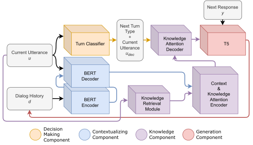
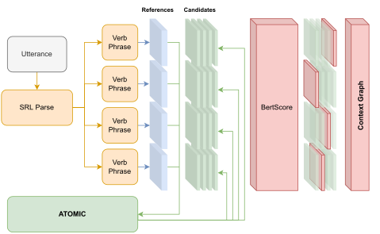
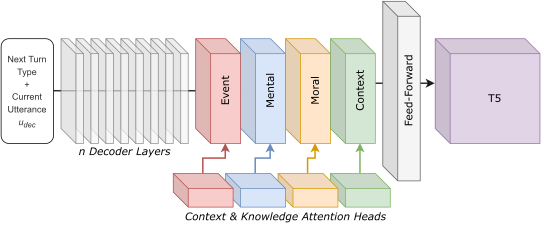

# Be Constructive, Helpful and Empathetic: Towards Situated Empathic Dialogue Generation Grounded in Social and Moral Commonsense Knowledge

Bachelor Thesis, Institute for Computational Linguistics, Heidelberg University

***

EN: In my Bachelor's thesis I wanted to take a look at the current language and dialog models and see how they are
capable of expressing empathy and building a situational commonsense knowledge graph. We mainly used the social, moral
and commonsense knowledge to support empathetic responding.
In this repo I will quickly outline the different modules and what they are doing.

CN: 在我的学士论文中，我想看看当前的语言和对话模型，看看它们如何能够表达同理心并构建情境常识知识图谱。 我们主要使用社会、道德和常识知识来支持移情反应。 在这个 repo 中，我将快速概述不同的模块以及它们在做什么。

Project structure:

- *src* – contains all source code for the project
- *src/data* – contains everything to data preprocessing and manipulation
- *src/models* – contains all models that have been trained for the thesis

Under the *src/models* folder you will be able to find:

- GPT-2, T5 baselines trained on Empathetic Dialogues
- Self-Attention Modifications with different encoder models (Bert, Transformer Encoder)
- Bert & Bert2Bert Dialog Contextualizer
- Bert & DistlBert as Turn Classifiers
- `DialogGuidingModule` which is the architecture that is contextualizing the dialog history and the current utterance,
  retrieving knowledge structures based on the current utterance, learning dedicated knowledge attention heads as well
  as classifying the next turn type. All this information flows towards the `Knowledge Attention Decoder`.
- *neural_empathy.py* contains the complete architecture presented in this thesis.

Some fine-tuned checkpoints are already available on `Huggingface` where you can download the checkpoint and continue
training. A full list of the architecture components:

- [x] [T5 Baseline](https://huggingface.co/benjaminbeilharz/t5-empatheticdialogues)
  , [GPT2 Baseline](https://huggingface.co/benjaminbeilharz/baseline)
- [x] [Bert2Bert Dialog Contextualizer](https://huggingface.co/benjaminbeilharz/bert2bert-empathetic-dialogues)
- [x] [Bert Next Turn Classifier](https://huggingface.co/benjaminbeilharz/bert-base-uncased-dailydialog-turn-classifier)
  , [DistilBert Next Turn Classifier](https://huggingface.co/benjaminbeilharz/distilbert-dailydialog-turn-classifier)
- [x] [T5 conditioned on Daily Dialog Templates](https://huggingface.co/benjaminbeilharz/t5-conditioned-next-turn)
- [ ] Dialog Guiding Module
- [ ] Full Architecture

The full architecture is depicted below:

The retrieval step can be used to get `Atomic`'s heads which are later encoded in the knowledge encoder.

While the specific knowledge attention was created this way:

Where the dedicated knowledge attention heads will be decoded in the Knowledge Attention Decoder.

I will be providing a more convenient main function to reproduce the results, and will continuosly improve on this
readme.